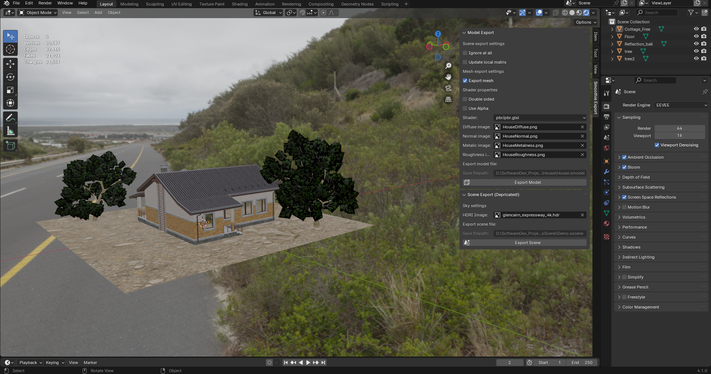
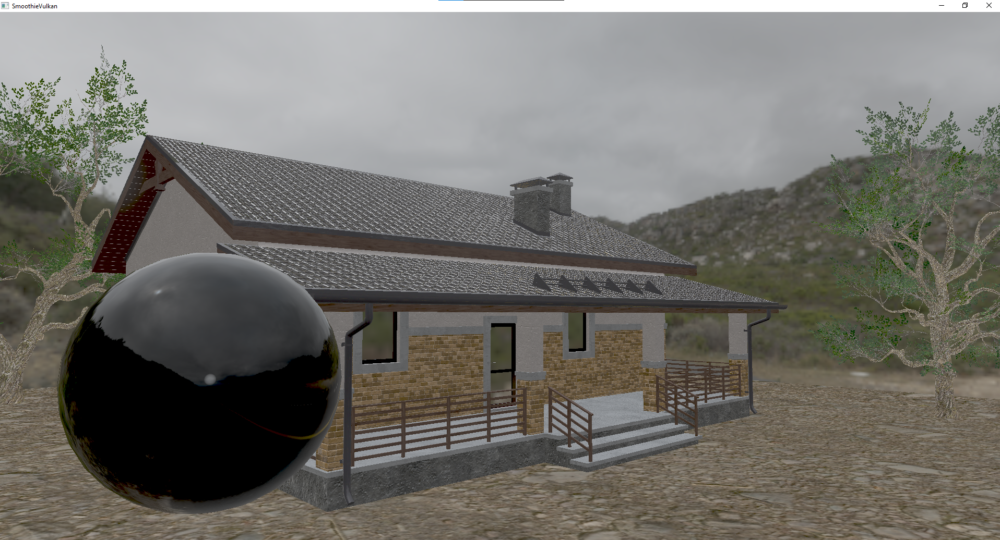

# About
  
**SmoothieVulkan** is a real time render engine, written in C++  and Vulkan.
It can be easily integrated within any game/game engine for rendering. It is a  successor of [Smoothie](https://github.com/MacolaDev/Smoothie) that is actively developed.

Right now it has:
- Physically based rendering (PBR)
- Physically based Bloom
- ACES Tone mapping 
- Multithreaded resource loading and resource management 
- Its own shader compiler (based on [glslang](https://github.com/KhronosGroup/glslang))
- Blender exporter for models and meshes, SmoothieExporter

SmoothieVulkan uses its own data formats for handling shader binaries (.sshader), models (.smodel), meshes (.sgeometry) and scenes (.sscene).  

I will also add Shadows, SSAO, SSR, Automatic Exposure and many more graphics features, as well as its own Scene editor and asset compiler.

As of now, it only supports Windows, but I plan Linux version at some point in the future too.

---  
# Dependencies:

Make sure you have installed:

- [Vulkan SDK 1.3](https://vulkan.lunarg.com/sdk/home#windows) or newer version

- [cmake](https://cmake.org/)

- *[Python](https://www.python.org/downloads/)

- [Visual Studio 2022](https://visualstudio.microsoft.com/downloads/)

before attempting to build this project.

*For building **any version of Python** should be fine, but for using SmoothieExporter you might need to use the same version of Python as the version that your Blender is using.  
You can check the version of Python that your Blender is using by going into Blender *Scripting* Workspace
and copy-pasting this command in the terminal: ``import sys; sys.version``
*Blender 4.1 that I have uses Python 3.11.7, newer versions of Blender probably use newer versions of Python.*

---
# How to build:

Clone the repository first:

``git clone https://github.com/MacolaDev/Smoothie.git --recursive``

Then go to folder where you cloned this repository and run :
``build_all_debug.bat`` or ``build_all_release.bat`` 
depending on what version you want to use. 
Cmake will then generate Visual Studio project files and solutions, build everything and compile shaders.  Once script finishes everything you can run the program.

If you plan to use *SmoothieExporter* for exporting data from Blender then you **must build SmoothieExporter in Release mode**, since Blender's interpreter does not use debug version of Python and so if you try to use *Debug* version, script won't work.

If you plan to modify the shader source code, open *SmoothieVulkan/Demo* folder in *cmd*  and run:
``python compile_shaders.py``
Script will then go thought  *shaders* folder and compile shaders with *ShaderCompiler.exe*

# Getting started:

This repository contains multiple projects:
- SmoothieEngine (Core of the engine, compiles to static library)
- Demo (Simple demo with *free camera* to move around the world) 
- Exporter (Python's extension module and all python scripts used in Blender)
- ShaderCompiler (Used to compile multiple shader source codes to SPIR-V for engine to load)

### Demo
The best starting point is to start *Demo.exe* to load default scene and explore. 
Use W, A, S, D and mouse to move around the world. Press ESC to close demo. 
Check *main.cpp, Demo.h and Demo.cpp* files to see the source code of how is everything implemented.

### Blender Exporter
Exporter folder contains Python code used in Blender export script and source code for Python extension module, SmoothieExporter that scripts uses to process geometry data fast.

To use script within Blender:
 1) Open Blender
 2) Go to *Scripting* Workplace
 3) Load ``__init__.py`` file
 4) Go to line 10 and change ``path = "absolute/path/to/your/SmoothieVulkan/Exporter"`` folder
 5) Run the script.
 
New tab *SmoothieExport* will appear in Layout, there you can find all settings that you need to export data from blender.  
> Note: Blender file that has main Demo scene is not included in this repository because of its size.  

### Shader Compiler
This compiler allows us to write multiple shaders inside one file (for example vertex and fragment shader) and then compile everything again into one binary file. Engine then loads source code for each shader from that file. 
In the future I will add more things in it, such as ``#includes`` and shader code optimization. 

---  
## Contact
If you have any questions, recommendation, or you would like to contribute to this project, feel free to contact me here or even better on [ my discord server](https://discord.gg/Mqh4Jmdh) (I'm more active there).